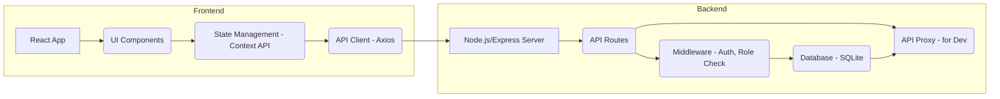
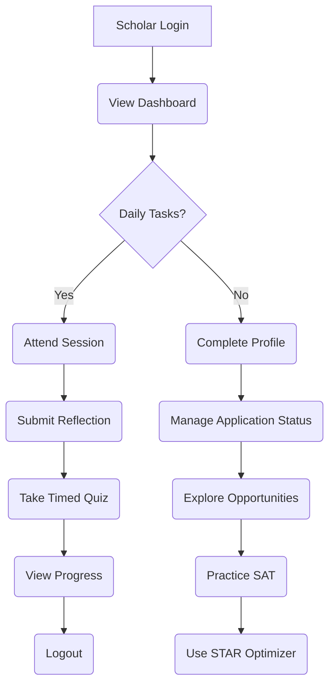
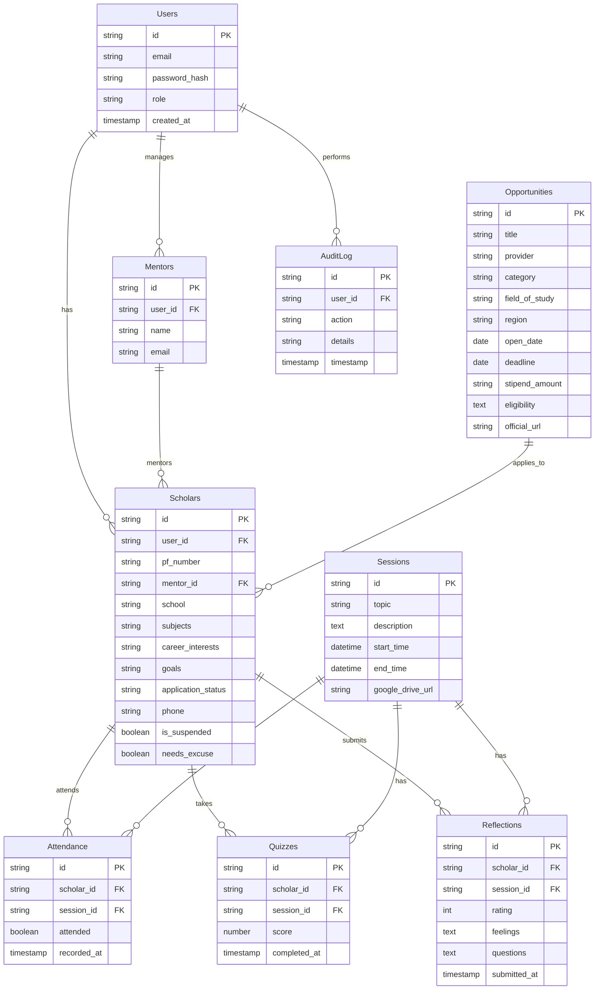
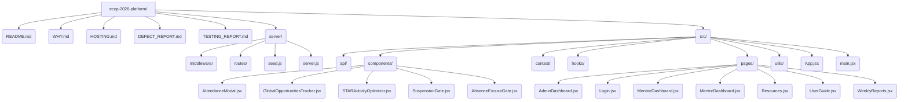

# ECCP 2026 Platform Overview

The ECCP 2026 Platform is a comprehensive React-based frontend application designed to streamline and enhance the Equity College Counselling Program. It provides a centralized, professional, and measurable system for managing scholars, mentors, and program administrators, replacing fragmented traditional methods.

## Core Purpose & Value Proposition

The platform aims to revolutionize college counselling by offering a secure, trackable, and professional environment.

### Why ECCP Platform?

Traditional mentorship relies on scattered tools like WhatsApp, Google Docs, and manual sheets. The ECCP Platform consolidates these into a single, robust system.

> [!TIP]
> **Key Advantage:** The platform offers a significant upgrade from traditional, fragmented mentorship tools, providing a unified and professional experience.

### Key Advantages

*   **Accountability & Evaluation:** Digital roll calls, timed quizzes, persistent messaging, and a daily ranking formula ensure measurable progress.
*   **Compliance & Security:** A complete audit trail logs every action, providing chronological history for incident follow-ups and robust security measures like JWT, role-based access, and login attempt tracking.
*   **Efficiency:** Automates tasks like attendance tracking, quiz grading, and report generation, freeing up valuable time for mentors and administrators.
*   **Centralized Information:** Provides a single source of truth for program timelines, opportunities, and scholar progress.

---

## System Architecture

The ECCP 2026 Platform is built with a React frontend and a lightweight Node.js/Express backend, utilizing SQLite for data persistence during development.



### Frontend Components

The frontend is built using React and leverages various libraries for state management, routing, and UI elements.

*   **UI Components:** Reusable components for various platform features (e.g., `AttendanceModal`, `STARActivityOptimizer`).
*   **State Management:** Primarily uses React's Context API (`ThemeContext`, `AuthContext`) for global state.
*   **API Client:** Handles communication with the backend API.
*   **Routing:** Managed by `react-router-dom` for navigation between different pages.

### Backend Services

The backend provides the API endpoints for the frontend and handles data persistence and business logic.

*   **API Routes:** Defines the endpoints for user authentication, data management, and administrative functions.
*   **Middleware:** Implements authentication (`authenticate`) and role-based access control (`requireRole`).
*   **Database:** Uses SQLite for local development data storage.

> [!IMPORTANT]
> **Security Enhancement:** For production, it's crucial to use a more robust database and ensure a strong, unique `JWT_SECRET` is configured.

---

## Key Features & Modules

The platform offers distinct functionalities tailored for Scholars (Mentees), Mentors, and Organization Administrators.

### 1. Scholar (Mentee) Experience

Scholars engage with the platform daily for structured learning and application support.

*   **Daily Routine:** Access to daily topics, motivation quotes, and mandatory reflections.
*   **Sessions:** Join scheduled sessions with provided links.
*   **Profile Management:** Complete personal details, academic interests, and application status.
*   **Accountability Tools:**
    *   **Timed Quizzes:** Auto-graded quizzes with penalties for missed deadlines.
    *   **Daily Reflections:** Mandatory submission of ratings, feelings, and questions.
    *   **Absence Excuse Submission:** A formal process to explain absences and regain access.
*   **Application Support:**
    *   **Application Status Tracker:** Monitor progress towards target universities.
    *   **STAR Activity Optimizer:** Tool to craft compelling college-activity descriptions.
    *   **Global Opportunities Tracker:** Browse scholarships, fellowships, and academic programs.
*   **SAT Preparation:** Access to the SAT Preparation Simulator for practice.



### 2. Mentor Experience

Mentors guide scholars, track their progress, and provide support.

*   **Scholar Oversight:** View scholar profiles, attendance, and quiz scores.
*   **Session Management:** Participate in and confirm scholar attendance for sessions.
*   **Support Features:**
    *   **Absence Excuse Gate:** Monitor scholars needing to submit excuses.
    *   **SAT Preparation Simulator:** Utilize the tool to guide scholars.
    *   **STAR Activity Optimizer:** Assist scholars in crafting descriptions.
    *   **Global Opportunities Tracker:** Guide scholars to relevant opportunities.
*   **Communication:** Send messages to assigned scholars.
*   **Reporting:** Generate weekly mentor reports.

### 3. Organization Administrator Experience

Admins have full control over the platform, user management, and program oversight.

*   **Command Center:** Monitor overall platform statistics (scholars, attendance, profiles).
*   **User Management:**
    *   Add/remove scholars and mentors.
    *   Assign mentors to scholars.
    *   Reset passwords and send credentials.
*   **Session Management:** Create, edit, and delete global sessions.
*   **Program Timeline:** Manage and update the program timeline visible to all users.
*   **Communication Center:** Broadcast messages and configure email reminders (SMTP).
*   **Audit & Security:**
    *   **Platform History:** Review a chronological audit trail of all platform activities.
    *   **Admin Surveillance Hub:** Real-time monitoring of platform activities.
    *   **Security Hardening:** Configure JWT secrets, monitor login attempts.
*   **Reporting & Exports:** Export scholar profiles, rankings, and compliance reports.
*   **Opportunity Management:** Add, edit, and remove global opportunities.
*   **Automated Workflows:** Manage disciplinary actions like suspension and absence excuse gates.



---

## Development & Deployment

The repository contains both frontend and backend code, with a lightweight server for development.

### Repository Structure



### Quick Start

1.  **Clone the repository:**
    ```bash
    git clone https://github.com/Jean-Regis-M/eccp-2026-platform.git
    cd eccp-2026-platform
    ```
2.  **Install dependencies:**
    ```bash
    npm install
    ```
3.  **Run the development server:**
    ```bash
    npm run dev
    ```
    This starts the frontend on port 5173 and the API on port 3001.

### Production Deployment

Refer to `HOSTING.md` for detailed instructions on deploying the platform to a production environment.

> [!TIP]
> **Production Readiness:** The `HOSTING.md` guide covers essential steps like setting up HTTPS, configuring environment variables, and performing post-deploy checks.

---

## Security & Defect Considerations

The platform incorporates security measures, but ongoing vigilance and improvements are necessary.

### Authentication & Security

*   **JWT-based Authentication:** Securely verifies user identity.
*   **Role-Based Access Control:** Ensures users only access authorized features.
*   **Login Attempt Tracking:** Logs failed login attempts for security monitoring.

> [!WARNING]
> **Critical Security Defect (SEC-01):** The `JWT_SECRET` is hardcoded in `server/middleware/auth.js`. This is a critical vulnerability.
> **Action:** Always use environment variables for sensitive secrets like `JWT_SECRET` in production.

> [!WARNING]
> **Security Defect (SEC-02):** Default passwords are hardcoded.
> **Action:** Ensure default passwords are not exposed and are immediately changed upon first use.

### Frontend State Management

The platform uses `localStorage` for certain state persistence and drafts.

> [!TIP]
> **Potential Issue (FE-02):** Reliance on `localStorage` for state management can have limitations regarding data size and security.
> **Suggestion:** For more complex or sensitive data, consider a more robust client-side state management solution or server-side persistence.

### Defect Report Summary

A comprehensive defect report (`DEFECT_REPORT.md`) highlights structural and security-related issues, emphasizing the need for enterprise readiness. Key areas include:

*   **Authentication & Security:** Hardcoded secrets, insecure default passwords, and token management.
*   **Backend Logic:** Potential issues in data validation and error handling.
*   **Frontend & Code Quality:** Unused utilities and `localStorage` reliance.

---

## Theming & Customization

The platform supports theme switching between 'dark' and 'light' modes.

```jsx
// source: src/context/ThemeContext.jsx:L5-L27
import { createContext, useContext, useEffect, useState } from 'react';

const ThemeContext = createContext(null);

export function ThemeProvider({ children }) {
  const [theme, setTheme] = useState(() => localStorage.getItem('eccp_theme') || 'dark');

  useEffect(() => {
    const root = document.documentElement;
    root.classList.remove('light', 'dark');
    root.classList.add(theme);
    localStorage.setItem('eccp_theme', theme);
  }, [theme]);

  const toggleTheme = () => setTheme(t => (t === 'dark' ? 'light' : 'dark'));

  return (
    <ThemeContext.Provider value={{ theme, setTheme, toggleTheme }}>
      {children}
    </ThemeContext.Provider>
  );
}

export const useTheme = () => {
  const ctx = useContext(ThemeContext);
  if (!ctx) throw new Error('useTheme must be used within ThemeProvider');
  return ctx;
};
```

The `ThemeProvider` component wraps the application, allowing components to access and toggle the current theme. The theme preference is persisted in `localStorage`.

> [!TIP]
> **Customization:** The `ThemeProvider` can be extended to manage other global UI settings or preferences.

---

## Program Timeline & Sessions

The platform manages the program's schedule, including daily sessions and key phases.

### Sample Session Data

```javascript
// source: server/seed.js:L10-L20
[
  { date: '2026-06-10', topic: 'Application Documents & SAT Introduction', description: 'Overview of application documents needed. Introduction to SAT structure. Fix Microsoft login issues for Bluebook.' },
  { date: '2026-06-11', topic: 'SAT Math Fundamentals', description: 'Core SAT math concepts and strategies. Analytical reading techniques. Begin diagnostic test review.' },
  { date: '2026-06-12', topic: 'Bluebook Installation & Prognostic Test', description: 'Install College Board Bluebook app. Take SAT prognostic test. Review initial scores and set improvement goals.' },
  { date: '2026-06-15', topic: 'University Application Strategies', description: 'Study group formation. Personal statement brainstorming. Develop compelling essay topics.' },
  { date: '2026-06-16', topic: 'Personal Statement Development', description: 'Draft personal statements in Google Docs. Begin activities list and honors list.' }
]
```

Administrators can create and manage these sessions, which are then displayed to scholars and mentors. The `Program Timeline` feature allows admins to define key phases of the bootcamp, visible to all users for alignment.

> [!IMPORTANT]
> **Data Integrity:** Ensure session dates and descriptions are accurate and aligned with the ECCP 2026 bootcamp schedule.

---

## User Guides

Detailed guides are available for each user role.

*   **Org Admin User Guide (`docs/USER_GUIDE_ADMIN.md`):** Covers daily tasks, user management, session control, and program timeline editing.
*   **Scholar (Mentee) User Guide (`docs/USER_GUIDE_MENTEE.md`):** Outlines the step-by-step platform usage, from login to daily routines and profile completion.
*   **Mentor User Guide (`docs/USER_GUIDE_MENTOR.md`):** Provides guidelines for mentors, including scholar support features and responsibilities.

These guides are crucial for onboarding new users and ensuring effective utilization of the platform's features.
